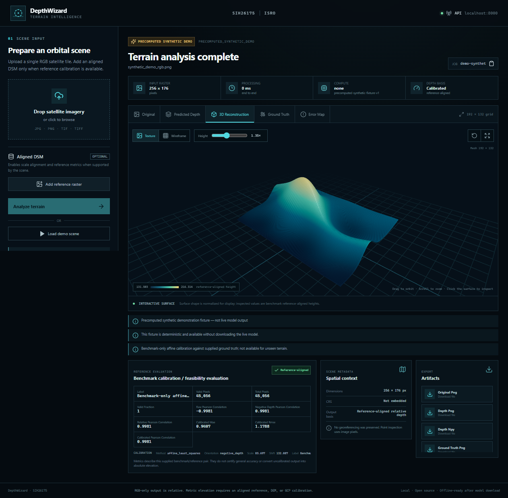

# DepthWizard — SIH26175

DepthWizard is a local, GPU-aware demonstration and evaluation workbench for
monocular depth on aerial imagery. A React/Vite interface calls a FastAPI
service, which runs Depth Anything V2 and writes inspectable artifacts for each
job. A coarse reference DEM or sparse elevation GCPs can calibrate the relative
prediction into an estimated metric DSM; an optional aligned ground-truth DSM
enables benchmark evaluation.

> **Scientific scope:** the model predicts **relative monocular depth**, not
> metric elevation. Relative depth can order scene structure, but a single RGB
> image does not determine absolute scale or vertical datum. DepthWizard only
> produces an estimated metric DSM after fitting an affine mapping to an
> explicit reference DEM/GCP set. Fitting against the full evaluation DSM is a
> separate benchmark-only mode: it is useful for feasibility analysis but is
> non-deployable and must not be reported as accuracy on unseen data.

No accuracy result is bundled or claimed by this repository.



_Bundled precomputed synthetic demonstration fixture — not live model output or
a real-world benchmark result. Live upload analysis uses the local model._

## Architecture

```text
Browser (React + Vite, :5173)
              |
              | JSON / multipart HTTP
              v
FastAPI service (:8000) ---- GET /api/demo (precomputed synthetic fixture)
              |
              +---- Depth Anything V2 Small ---- relative depth
              |
              +---- optional DEM or GCPs ---- deployment-style affine estimate
              |
              +---- optional aligned DSM ---- benchmark/holdout metrics
              |
              `---- configured artifact root/<job_id> + /artifacts/... URLs
```

- `frontend/` contains the Vite user interface.
- `backend/` contains the API and job-artifact handling.
- `ml/` contains inference, calibration, metrics, and rendering logic.
- `scripts/` contains command-line feasibility and evaluation entry points.
- `data/` is intentionally untracked apart from placement guidance.

## Prerequisites

The supported setup is Windows 10/11 with PowerShell, Python **3.11 or 3.12**,
and Node.js **20.19+ or 22.12+** with npm (required by the pinned Vite 7 toolchain).
Python 3.14 is not recommended because compatible PyTorch wheels may be
unavailable. Live inference can run on CPU, but an NVIDIA RTX GPU (including an
RTX 4050) is substantially more practical.

For GPU use, install a current NVIDIA driver and a CUDA-enabled PyTorch build
compatible with that driver. A separate CUDA Toolkit is normally unnecessary
for a prebuilt PyTorch wheel. DepthWizard detects CUDA through PyTorch and falls
back to CPU when CUDA is unavailable; it does not silently fabricate a result.

Check the environment after installing dependencies:

```powershell
python -c "import torch; print('PyTorch:', torch.__version__); print('CUDA:', torch.cuda.is_available()); print('Device:', torch.cuda.get_device_name(0) if torch.cuda.is_available() else 'CPU')"
```

## Install

From the repository root:

```powershell
py -3.12 -m venv .venv
Set-ExecutionPolicy -Scope Process Bypass
.\.venv\Scripts\Activate.ps1
python -m pip install --upgrade pip
python -m pip install -r requirements.txt

# RTX laptop (current official CUDA 13.0 wheel; use PyTorch's selector if newer):
python -m pip install --upgrade torch --index-url https://download.pytorch.org/whl/cu130

Set-Location frontend
npm install
Set-Location ..
```

If PyTorch reports `CUDA: False` on an NVIDIA system, install the appropriate
CUDA build of PyTorch for the installed driver, then repeat the check above.
The `cu130` command shown above matches the current wheels and this prototype's
tested RTX 4050 driver; consult PyTorch's official install selector for older
drivers or future wheel versions.

## Model cache and offline operation

Live inference defaults to
`depth-anything/Depth-Anything-V2-Small-hf`. On the first live request,
Transformers downloads the model from Hugging Face, so network access and cache
space are required. Configure the process before starting the backend:

```powershell
$env:DEPTHWIZARD_MODEL_ID = "depth-anything/Depth-Anything-V2-Small-hf"
$env:DEPTHWIZARD_MAX_INPUT_SIZE = "1024"
$env:DEPTHWIZARD_MAX_DECODED_PIXELS = "50000000"
$env:DEPTHWIZARD_ARTIFACT_DIR = "outputs/jobs"
$env:HF_HOME = "$PWD\.cache\huggingface"
```

For offline use, first populate the cache with one successful online inference,
then start a new PowerShell session with the same cache path and:

```powershell
$env:HF_HUB_OFFLINE = "1"
$env:TRANSFORMERS_OFFLINE = "1"
```

Offline live inference cannot initialize if the selected model revision is not
already cached. `GET /api/demo` remains a precomputed synthetic demonstration;
it is not proof that the live model is installed. See `.env.example` for the
available settings. Settings are process environment variables; export them in
PowerShell before launching the service.

## Start

Use two PowerShell windows from the repository root:

```powershell
.\start-backend.ps1
```

```powershell
.\start-frontend.ps1
```

Then open <http://localhost:5173>. The API is at
<http://localhost:8000>; interactive FastAPI documentation is at
<http://localhost:8000/docs>. The equivalent direct commands are:

```powershell
python -m uvicorn backend.app:app --host 127.0.0.1 --port 8000
Set-Location frontend; npm run dev
```

The frontend uses `VITE_API_URL`, defaulting to `http://localhost:8000`.
Set it before `npm run dev` when the API runs elsewhere.

## Demo and live workflow

1. Start both services and select **Load Demo Scene**. This calls
   `GET /api/demo` and loads a **precomputed synthetic demonstration fixture**.
   It is explicitly labelled and is not live model output or a benchmark result.
2. Upload an image and analyze it to run live relative-depth inference. The first
   run may pause while model weights download.
3. Optionally supply either a coarse reference DEM (including SRTM/CartoDEM) or
   at least three zero-based pixel GCPs to create an estimated metric DSM.
4. Optionally supply an aligned ground-truth DSM. Without a separate calibration
   reference it performs a same-scene benchmark fit; with a DEM/GCP reference it
   evaluates the fixed calibration without refitting against ground truth.
5. Inspect/download the artifact URLs returned by the API. Each live response
   records its model, device, mode, timing, notices, and geospatial metadata.

The live endpoint never substitutes the synthetic demo for failed or unavailable
model inference.

## Command-line feasibility and evaluation

Run the commands from the repository root with the virtual environment active.
Use explicit output directories to keep runs separate.

Relative-depth feasibility (no metric accuracy claim):

```powershell
python scripts/test_depth.py data/sample/IMAGE.tif --output-dir outputs/feasibility --max-input-size 1024
```

Evaluation with a pixel-aligned ground-truth DSM:

```powershell
python scripts/evaluate_depth.py --image data/sample/IMAGE.tif --ground-truth data/sample/GROUND_TRUTH_DSM.tif --output-dir outputs/evaluation --max-input-size 1024
```

Deployment-style calibration from a coarse DEM:

```powershell
python scripts/calibrate_depth.py --image data/sample/IMAGE.tif --reference-dem data/sample/REFERENCE_DEM.tif --output-dir outputs/calibrated
```

Or from sparse GCPs (CSV headers `x,y,elevation`, zero-based image pixels):

```powershell
python scripts/calibrate_depth.py --image data/sample/IMAGE.tif --gcps data/sample/GCP.csv --output-dir outputs/calibrated
```

Add `--ground-truth data/sample/GROUND_TRUTH_DSM.tif` to either calibration
command for fixed-calibration holdout scoring; the DSM is evaluated but never
used to refit the DEM/GCP calibration.

The feasibility command answers whether the pipeline can produce coherent
relative depth for an image. It cannot measure metric error without ground
truth. The evaluation command uses ground-truth correlation to choose the
relative-depth orientation, fits `height = a * oriented_depth + b` on valid DSM
pixels, and reports error after that same-scene fit. This removes orientation,
scale, and shift using ground truth and therefore does **not** demonstrate
zero-shot metric-depth deployment. For a defensible study, choose calibration
parameters on separate calibration tiles and evaluate on held-out tiles; the
provided full-GT command does not implement that protocol.

## Datasets

The official ISRO/SAC reference repository is checked first. ISPRS Potsdam is
the primary development benchmark, Vaihingen is secondary, and SRTM 30 m or
NRSC/Bhuvan CartoDEM can serve as coarse calibration references. A downloader
for a compact real DC urban RGB/DSM smoke-test pair is also included. See the
[dataset guide](docs/DATASETS.md) for current upstream status, official links,
scientific roles, download sizes, and placement instructions.

Quick real-data smoke test:

```powershell
python scripts/check_official_sac_data.py
python scripts/download_dc_sample.py
python scripts/evaluate_depth.py --image data/sample/dc-urban/rgb_2021.tif --ground-truth data/sample/dc-urban/dsm_2020.tif --output-dir outputs/dc-smoke-test
```

The DC RGB and DSM were acquired in different years, so this verifies the
pipeline but is not a clean accuracy benchmark. A convenient local layout is:

```text
data/
  isprs/
    potsdam/
      images/
      dsm/
    vaihingen/
      images/
      dsm/
  sample/
    README.md
```

This layout is organizational only: the CLI accepts explicit file paths and
does not automatically discover, pair, split, or batch-score ISPRS tiles. Pair
an image with the correct DSM tile, verify pixel alignment, resolution, CRS,
vertical units, and no-data values, and keep calibration and evaluation tiles
separate. Do not compare numbers across Potsdam/Vaihingen or preprocessing
variants without documenting those choices.

## API

| Method | Route | Purpose |
| --- | --- | --- |
| `GET` | `/api/health` | Service/model/device status |
| `GET` | `/api/demo` | Precomputed synthetic fixture; no live inference |
| `POST` | `/api/analyze` | Live inference; `image` plus optional DSM and one DEM/GCP reference |
| `GET` | `/artifacts/{job_id}/{filename}` | Generated artifact download |

Example calls:

```powershell
curl.exe http://localhost:8000/api/health
curl.exe -F "image=@data/sample/IMAGE.tif" http://localhost:8000/api/analyze
curl.exe -F "image=@data/sample/IMAGE.tif" -F "ground_truth_dsm=@data/sample/GROUND_TRUTH_DSM.tif" http://localhost:8000/api/analyze
curl.exe -F "image=@data/sample/IMAGE.tif" -F "reference_dem=@data/sample/SRTM.tif" http://localhost:8000/api/analyze
curl.exe -F "image=@data/sample/IMAGE.tif" -F "gcps=@data/sample/GCP.csv" -F "gcp_sampling=bilinear" http://localhost:8000/api/analyze
```

`reference_dem` and `gcps` are mutually exclusive. `ground_truth_dsm` is always
an evaluation input when a deployment reference is present; otherwise it is
used for the explicitly labelled full-ground-truth benchmark fit.

Live responses include `job_id`, `demo`, `precomputed`, `model`, `device`,
`mode`, `input`, `processing_time_seconds`, `geospatial`, `metrics`,
`calibration`, `reference`, `depth_grid`, `urls`, `artifacts`, and `notices`.

## Outputs and GeoTIFF behavior

A run can write `original.png`, `depth.png`, and `depth.npy`. Reference-DEM runs
can add `reference_dem.png`; calibrated runs add calibrated DSM PNG/NPY and,
when source georeferencing is valid, GeoTIFF. Runs with ground truth can add
`ground_truth.png`, `error.png`, and `metrics.json`. API artifacts are grouped
by job ID; CLI files go to the explicit `--output-dir`. Unless
`DEPTHWIZARD_ARTIFACT_DIR` overrides it, the API artifact root is
`backend/artifacts/`.

When a calibrated result and source image with a valid GeoTIFF CRS and affine
transform are available, the pipeline can write `calibrated_dsm.tif` using the
source georeferencing. PNG previews and
`depth.npy` are visualization/numeric artifacts, not georeferenced metric
products. A calibrated GeoTIFF inherits horizontal metadata but its vertical
meaning is only as valid as the supplied DSM, alignment, units, and affine fit.

If both rasters carry usable georeferencing but their grids differ, DepthWizard
reprojects/resamples the DSM onto the image grid and records a notice. With
matching dimensions but incomplete georeferencing, it assumes pixel-for-pixel
alignment. As a last resort for differently sized ungeoreferenced rasters, it
performs a numeric resize and reports that fact; such results need especially
careful interpretation.

## Limitations

- Monocular relative depth is ambiguous in absolute scale and shift and is not
  a replacement for stereo, LiDAR, photogrammetry, or surveyed elevation.
- A full-GT affine fit is data leakage for deployment evaluation. Its metrics
  are same-scene, post-calibration diagnostics only. Use separate DEM/GCP
  calibration and ground-truth inputs for defensible holdout evaluation.
- Coarse DEM calibration supplies broad terrain scale/offset, not missing
  building/vegetation detail; GCP estimates depend strongly on count, coverage,
  surveying quality, and pixel registration.
- Domain shift, haze, shadows, seasonal change, roofs/trees, image channel
  composition, resolution, tiling, and resizing can materially affect output.
- Image/DSM misregistration, CRS or vertical-datum mismatch, and mishandled
  no-data pixels can dominate reported errors.
- GPU memory use rises with input size. Lower `--max-input-size` or
  `DEPTHWIZARD_MAX_INPUT_SIZE` if an RTX 4050 runs out of memory; CPU fallback is
  slower.
- Decoded inputs default to a 50,000,000-pixel safety limit, configurable with
  `DEPTHWIZARD_MAX_DECODED_PIXELS`. This is a decoded-pixel limit, not a file-size
  limit.
- The demo is synthetic and precomputed. It must not be presented as measured
  model accuracy or as a live-inference result.
